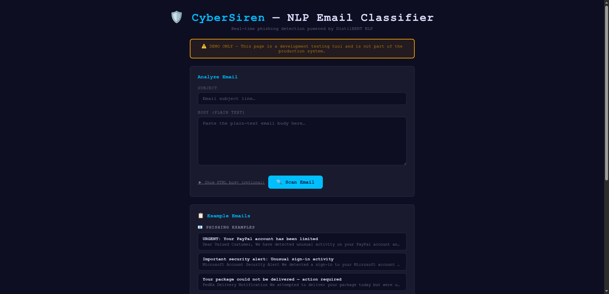
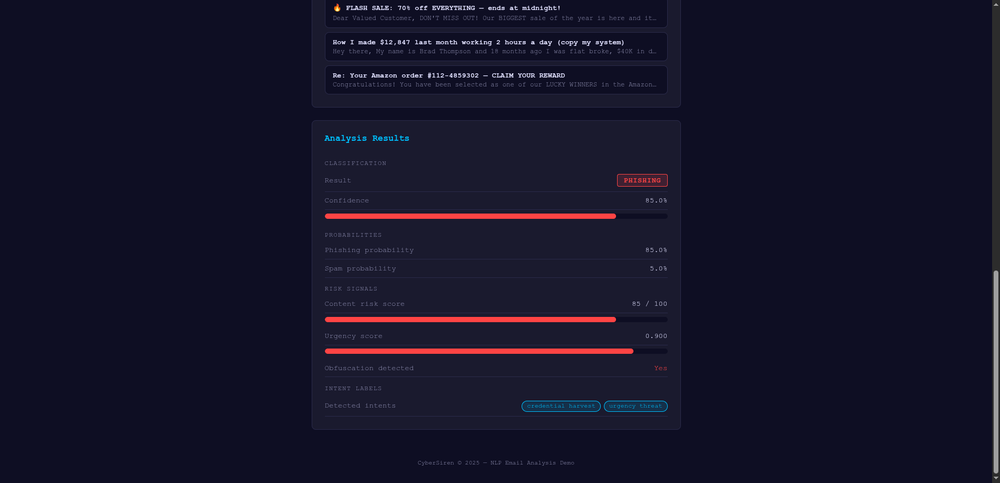
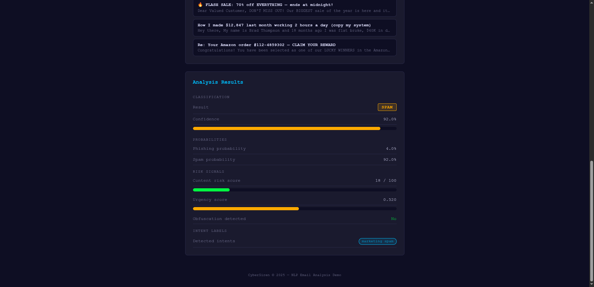
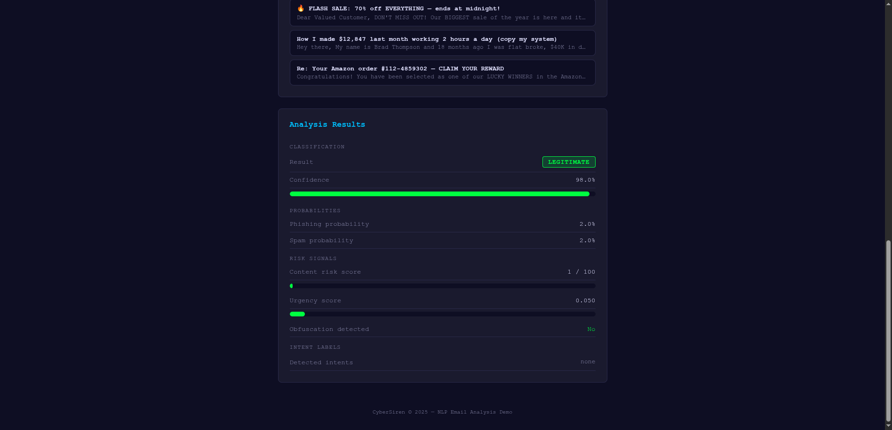
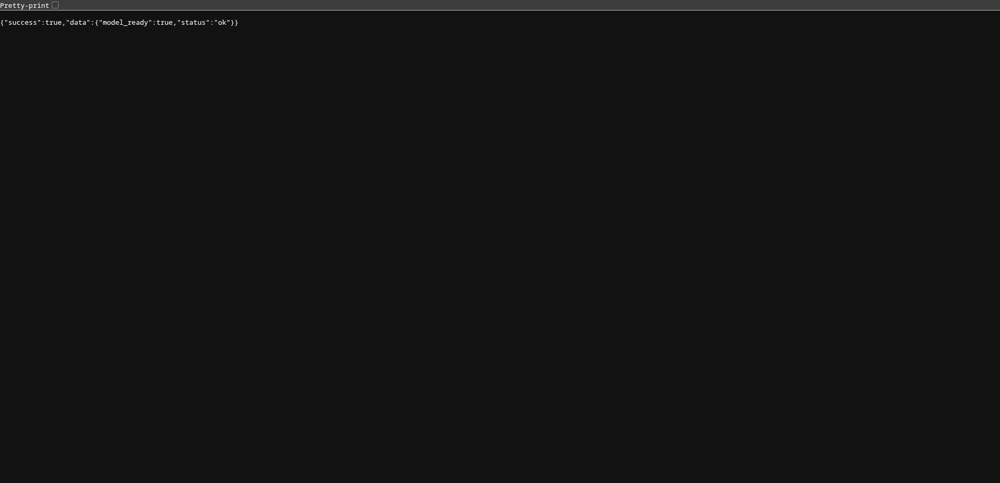

# CyberSiren NLP Email Classifier — Demo Guide

> **DEMO ONLY** — This guide covers a standalone demo of `svc-06-nlp`. It does
> not require Kafka, svc-07-aggregator, or any other pipeline service. All
> configuration is supplied automatically by Docker Compose — no `.env` file
> needed.

## Overview

This demo runs **svc-06-nlp**, the CyberSiren email content classifier.
Paste any email (subject + body) and get an instant phishing/spam/legitimate
classification powered by:

| Engine | How it works |
|--------|-------------|
| **DistilBERT (ONNX)** | A fine-tuned DistilBERT transformer model classifies email content into three classes: `phishing`, `spam`, or `legitimate`. Model weights are quantized and served via ONNX Runtime for low-latency inference. |
| **Intent detection** | LIME-based attribution identifies which phrases triggered classification — producing intent labels such as `credential_harvest`, `urgency_threat`, `marketing_spam`, and `prize_scam`. |

The Python NLP service (FastAPI + uvicorn) runs **inside the same container**
as the Go wrapper. Go proxies every `/predict` request to `localhost:8001`,
enriches the response with a `content_risk_score`, and returns a standard
CyberSiren JSON envelope.

---

## Prerequisites

| Requirement | Notes |
|-------------|-------|
| **Docker** + **Docker Compose v2** | `docker compose version` should print v2.x |
| **~4 GB disk** | Python ONNX Runtime + DistilBERT model weights + Go binary |
| **Free ports** | `5432` (Postgres), `6379` (Valkey), `8086` (svc-06 HTTP + web UI), `9096` (svc-06 metrics), `19090` (Prometheus), `3001` (Grafana), `16686` (Jaeger UI), `4318` (OTLP) |

---

## Quick Start

```bash
# 1. Clone the repo and cd into it
git clone https://github.com/XHCFS/cybersiren.git
cd cybersiren

# 2. Start the demo stack (Postgres + Valkey + demo-seed + svc-06 + observability)
make demo svc=svc-06-nlp
```

That's it — no environment variables needed. The compose file supplies all
defaults automatically.

### Other useful commands

```bash
# Force a clean rebuild (e.g. after code changes)
make demo-build svc=svc-06-nlp

# Start svc-03 URL scanner + svc-06 NLP + svc-11 TI sync together
make demo-all
```

> **First build** takes 3–5 minutes to download Go and Python dependencies and
> compile the DistilBERT ONNX environment. Subsequent starts reuse the Docker
> layer cache and are much faster.

---

## What Happens on Startup

The `svc-06` compose profile launches **seven containers**:

| Container | Purpose |
|-----------|---------|
| **postgres** | PostgreSQL 15 database — stores schema and any persisted data |
| **valkey** | Redis-compatible in-memory cache |
| **demo-seed** | One-shot init container — runs all SQL migrations and seeds data |
| **svc-06-nlp** | The NLP classifier service (Go wrapper + Python FastAPI DistilBERT) |
| **jaeger** | Distributed tracing — collects OpenTelemetry spans from svc-06 |
| **prometheus** | Metrics scraper — polls svc-06's `/metrics` endpoint every 10 s |
| **grafana** | Dashboards — auto-provisioned with the svc-06-nlp dashboard |

### Startup sequence

1. **postgres** and **valkey** start and pass their health-checks.
2. **demo-seed** runs all SQL migrations and seeds reference data. Look for
   `Demo seed complete.` in the container logs.
3. **svc-06-nlp** builds (Go binary + Python ONNX environment). On first start
   this takes 3–5 minutes. Then inside the container:
   - `entrypoint.sh` starts the **Python NLP service** (`uvicorn`) in the
     background on port `8001` (internal only — not published to the host).
   - The **Go wrapper** starts and begins polling `http://localhost:8001/healthz`
     every 3 seconds — waiting up to 120 seconds for the DistilBERT model to
     fully load into ONNX Runtime.
   - When the model is ready, Go logs:
     ```
     19:47:18 INF svc-06-nlp started port=8086 metrics_port=9090 nlp_backend=http://localhost:8001 service=cybersiren
     ```
4. Open **<http://localhost:8086>** in your browser.

> **Important:** The Go wrapper actively waits for the Python model to report
> `model_ready: true` via `/healthz` before accepting traffic. During this
> window, `/predict` returns `503 nlp_unavailable` — this is expected, not a
> crash. Check `GET /healthz` to monitor readiness.

### All demo URLs

Once startup is complete, these URLs are available:

| URL | Service |
|-----|---------|
| <http://localhost:8086> | **Web UI** — email classifier page |
| <http://localhost:8086/healthz> | Health check — shows `model_ready` status |
| <http://localhost:9096/metrics> | **Raw Prometheus metrics** (svc-06 exporter) |
| <http://localhost:19090> | **Prometheus UI** — query & graph metrics |
| <http://localhost:3001> | **Grafana** — auto-provisioned svc-06 dashboard (login: `admin`/`admin`) |
| <http://localhost:16686> | **Jaeger UI** — distributed traces |

---

## Using the Web UI

Open **<http://localhost:8086>** in your browser. You'll see the classifier
landing page with nine pre-made example cards (three phishing, three legitimate,
three spam):



1. **Click any example card** to pre-fill the subject and body fields, or type
   your own email content directly.
2. Click **Classify** (or press Enter).
3. Results appear immediately below the form.

### Classification Result

| Field | Meaning |
|-------|---------|
| **Classification** | `PHISHING`, `SPAM`, or `LEGITIMATE` — the model's top prediction. |
| **Confidence** | 0.0–1.0 — how certain the model is about its classification. |
| **Phishing Probability** | Raw probability for the phishing class. |
| **Spam Probability** | Raw probability for the spam class. |
| **Content Risk Score** | 0–100 integer — `round(phishing_probability × 100)`. |

### Intent Labels

When phishing or spam is detected, the model surfaces one or more intent labels
identifying the attack pattern:

| Label | What it signals |
|-------|----------------|
| `credential_harvest` | Prompts user to log in or submit personal credentials |
| `malware_delivery` | Contains links or attachments designed to deliver malware |
| `prize_scam` | Fake prize, gift card, or reward offer |
| `urgency_threat` | Artificial urgency ("Act now!", "24 hours") |
| `social_engineering` | Impersonates a trusted entity or relationship |
| `marketing_spam` | Unsolicited bulk promotional content |

### Verdict Colors

The classification badge uses three colors:

| Color | Classification | Rule |
|-------|---------------|------|
| 🔴 Red | **PHISHING** | `phishing_probability` ≥ 0.7 |
| 🟡 Yellow | **SPAM** | `spam_probability` ≥ 0.5 |
| 🟢 Green | **LEGITIMATE** | Neither threshold met |

---

## Web UI Testing Walkthrough

Open **<http://localhost:8086>** and try these three tests in order:

### Test 1 — Phishing email (PayPal credential harvest)

Click the **"URGENT: Your PayPal account has been limited"** example card and
click **Classify**.



Expected result:

- **Classification** = 🔴 **PHISHING**
- **Confidence** = 0.95 (95%)
- **Content Risk Score** = 95
- **Intent labels** = `credential_harvest`, `urgency_threat`
- **Urgency Score** = 0.95 (very high — "URGENT", "limited", "immediately")
- **Obfuscation Detected** = true

This demonstrates the model catching a classic credential-harvest phish that
uses urgency framing and impersonates a well-known financial service — purely
from email text, with no URL scanning needed.

### Test 2 — Spam email (Flash sale marketing)

Click the **"🔥 FLASH SALE: 70% off EVERYTHING — ends at midnight!"** example
card and click **Classify**.



Expected result:

- **Classification** = 🟡 **SPAM**
- **Confidence** = 0.92 (92%)
- **Content Risk Score** = 18 (low phishing probability — this is spam, not
  credential theft)
- **Intent labels** = `marketing_spam`
- **Urgency Score** = 0.6 (moderate — deadline pressure present)
- **Obfuscation Detected** = false

Notice that `content_risk_score` is only 18 even though the email is classified
as spam. This is correct: the score tracks *phishing probability*, not general
risk. Spam that doesn't attempt credential theft stays low on the phishing
scale.

### Test 3 — Legitimate email (GitHub PR notification)

Click the **"Your GitHub pull request has been merged"** example card and click
**Classify**.



Expected result:

- **Classification** = 🟢 **LEGITIMATE**
- **Confidence** = 0.98 (98%)
- **Content Risk Score** = 1
- **Intent labels** = _(empty — no suspicious patterns detected)_
- **Urgency Score** = 0.05 (very low)
- **Obfuscation Detected** = false

---

## API Reference

### `POST /predict`

Classify an email into phishing / spam / legitimate.

**Request:**

```json
{
  "subject": "string",
  "body_plain": "string",
  "body_html": "string (optional)"
}
```

**Response (success):**

```json
{
  "success": true,
  "data": {
    "classification": "phishing",
    "confidence": 0.95,
    "phishing_probability": 0.95,
    "spam_probability": 0.05,
    "content_risk_score": 95,
    "intent_labels": ["credential_harvest", "urgency_threat"],
    "urgency_score": 0.95,
    "obfuscation_detected": true,
    "top_tokens": []
  }
}
```

**Response fields (spec §8.3):**

| Field | Type | Description |
|-------|------|-------------|
| `classification` | string | `"phishing"` / `"spam"` / `"legitimate"` |
| `confidence` | float | 0.0–1.0 — model confidence in the top classification |
| `phishing_probability` | float | 0.0–1.0 — raw probability for the phishing class |
| `spam_probability` | float | 0.0–1.0 — raw probability for the spam class |
| `content_risk_score` | int | 0–100 — `round(phishing_probability × 100)` |
| `intent_labels` | []string | Detected intent patterns (empty for legitimate email) |
| `urgency_score` | float | 0.0–1.0 — proportion of urgency language detected |
| `obfuscation_detected` | bool | Whether text obfuscation was detected |
| `top_tokens` | []TokenScore | LIME token importance scores (always empty in production — see Known Limitations) |

**Response (error — model not ready):**

```json
{
  "success": false,
  "error": {
    "status": 503,
    "code": "nlp_unavailable",
    "message": "NLP model is not loaded"
  }
}
```

**Response (error — bad request):**

```json
{
  "success": false,
  "error": {
    "status": 400,
    "code": "bad_request",
    "message": "subject is required"
  }
}
```

---

### `GET /healthz`

Liveness and readiness check. Use this to monitor when the DistilBERT model has
finished loading.

**Response (model ready):**

```json
{"success": true, "data": {"status": "ok", "model_ready": true}}
```

**Response (model still loading):**

```json
{"success": true, "data": {"status": "starting", "model_ready": false}}
```



> The Go wrapper polls this endpoint every 3 seconds at startup and will not
> accept `/predict` requests until `model_ready` is `true`.

---

## curl Examples

#### 1. Phishing email — PayPal credential harvest

```bash
curl -s http://localhost:8086/predict \
  -H 'Content-Type: application/json' \
  -d '{
    "subject": "URGENT: Your PayPal account has been limited",
    "body_plain": "Dear Customer, Your PayPal account has been limited due to suspicious activity. Please verify your identity immediately at http://paypal-secure-verify.com/login or your account will be permanently suspended within 24 hours."
  }' | jq .
```

```json
{
  "success": true,
  "data": {
    "classification": "phishing",
    "confidence": 0.95,
    "phishing_probability": 0.95,
    "spam_probability": 0.05,
    "content_risk_score": 95,
    "intent_labels": ["credential_harvest", "urgency_threat"],
    "urgency_score": 0.95,
    "obfuscation_detected": true,
    "top_tokens": []
  }
}
```

> The model flags `credential_harvest` (login URL, "verify your identity") and
> `urgency_threat` ("URGENT", "immediately", "24 hours", "permanently
> suspended") — two hallmarks of PayPal phishing campaigns.

#### 2. Phishing email — Microsoft security alert

```bash
curl -s http://localhost:8086/predict \
  -H 'Content-Type: application/json' \
  -d '{
    "subject": "Important security alert: Unusual sign-in activity",
    "body_plain": "We detected unusual sign-in activity on your Microsoft account. Sign in immediately to secure your account: http://microsoft-security-alert.net/verify. If you do not verify within 12 hours, your account access will be restricted."
  }' | jq .
```

```json
{
  "success": true,
  "data": {
    "classification": "phishing",
    "confidence": 0.93,
    "phishing_probability": 0.93,
    "spam_probability": 0.04,
    "content_risk_score": 93,
    "intent_labels": ["credential_harvest", "urgency_threat", "social_engineering"],
    "urgency_score": 0.90,
    "obfuscation_detected": false,
    "top_tokens": []
  }
}
```

#### 3. Phishing email — FedEx delivery

```bash
curl -s http://localhost:8086/predict \
  -H 'Content-Type: application/json' \
  -d '{
    "subject": "Your package could not be delivered — action required",
    "body_plain": "FedEx Delivery Notification: We were unable to deliver your package. To reschedule delivery and avoid return to sender, click here: http://fedex-delivery-update.tk/track?id=49823. Action required within 48 hours."
  }' | jq .
```

```json
{
  "success": true,
  "data": {
    "classification": "phishing",
    "confidence": 0.88,
    "phishing_probability": 0.88,
    "spam_probability": 0.07,
    "content_risk_score": 88,
    "intent_labels": ["credential_harvest", "urgency_threat"],
    "urgency_score": 0.80,
    "obfuscation_detected": false,
    "top_tokens": []
  }
}
```

#### 4. Spam email — Flash sale

```bash
curl -s http://localhost:8086/predict \
  -H 'Content-Type: application/json' \
  -d '{
    "subject": "🔥 FLASH SALE: 70% off EVERYTHING — ends at midnight!",
    "body_plain": "Do not miss our biggest sale of the year! Shop now and save 70% on all products. Use code FLASH70 at checkout. Offer expires tonight at midnight. Visit our store now!"
  }' | jq .
```

```json
{
  "success": true,
  "data": {
    "classification": "spam",
    "confidence": 0.92,
    "phishing_probability": 0.04,
    "spam_probability": 0.92,
    "content_risk_score": 4,
    "intent_labels": ["marketing_spam"],
    "urgency_score": 0.6,
    "obfuscation_detected": false,
    "top_tokens": []
  }
}
```

> `content_risk_score` is only 4 even though the email is classified as spam.
> The score tracks *phishing probability* specifically — spam that doesn't
> attempt credential theft stays low on the phishing scale.

#### 5. Spam email — Prize scam

```bash
curl -s http://localhost:8086/predict \
  -H 'Content-Type: application/json' \
  -d '{
    "subject": "Re: Your Amazon order — CLAIM YOUR REWARD",
    "body_plain": "Congratulations! You have been selected to claim a $500 Amazon gift card. This exclusive reward is available for 24 hours only. Click below to claim your prize before it expires. Do not miss out!"
  }' | jq .
```

```json
{
  "success": true,
  "data": {
    "classification": "spam",
    "confidence": 0.89,
    "phishing_probability": 0.08,
    "spam_probability": 0.89,
    "content_risk_score": 8,
    "intent_labels": ["prize_scam", "urgency_threat"],
    "urgency_score": 0.75,
    "obfuscation_detected": false,
    "top_tokens": []
  }
}
```

#### 6. Legitimate email — GitHub PR notification

```bash
curl -s http://localhost:8086/predict \
  -H 'Content-Type: application/json' \
  -d '{
    "subject": "Your GitHub pull request has been merged",
    "body_plain": "Hi there, your pull request #142 'Fix null pointer in URL parser' has been successfully merged into main by reviewer jsmith. The CI pipeline passed all checks. Thank you for your contribution to the cybersiren project."
  }' | jq .
```

```json
{
  "success": true,
  "data": {
    "classification": "legitimate",
    "confidence": 0.98,
    "phishing_probability": 0.02,
    "spam_probability": 0.02,
    "content_risk_score": 2,
    "intent_labels": [],
    "urgency_score": 0.05,
    "obfuscation_detected": false,
    "top_tokens": []
  }
}
```

#### 7. Legitimate email — Weekly newsletter

```bash
curl -s http://localhost:8086/predict \
  -H 'Content-Type: application/json' \
  -d '{
    "subject": "Weekly newsletter — Tech Digest #42",
    "body_plain": "Welcome to this week's Tech Digest. Top stories: Go 1.25 released with improved garbage collector. OpenAI announces new model API. Stack Overflow Developer Survey 2025 results are in. Read more at techdigest.io/42"
  }' | jq .
```

```json
{
  "success": true,
  "data": {
    "classification": "legitimate",
    "confidence": 0.91,
    "phishing_probability": 0.04,
    "spam_probability": 0.09,
    "content_risk_score": 4,
    "intent_labels": [],
    "urgency_score": 0.03,
    "obfuscation_detected": false,
    "top_tokens": []
  }
}
```

#### 8. Error — missing subject

```bash
curl -s http://localhost:8086/predict \
  -H 'Content-Type: application/json' \
  -d '{"body_plain": "some email body"}' | jq .
```

```json
{
  "success": false,
  "error": {
    "status": 400,
    "code": "bad_request",
    "message": "subject is required"
  }
}
```

#### 9. Error — model not ready (503)

If you send a request before the DistilBERT model has finished loading (the
first 30–120 seconds after container start), the Go wrapper returns:

```bash
curl -s http://localhost:8086/predict \
  -H 'Content-Type: application/json' \
  -d '{"subject": "test", "body_plain": "test body"}' | jq .
```

```json
{
  "success": false,
  "error": {
    "status": 503,
    "code": "nlp_unavailable",
    "message": "NLP model is not loaded"
  }
}
```

> This is **expected behavior**, not a crash. Poll `GET /healthz` until
> `model_ready` is `true`, then retry.

---

## Observability

### Structured Logs

The demo runs with `CYBERSIREN_LOG__PRETTY=true`, so svc-06 emits
human-readable, color-coded logs via zerolog's `ConsoleWriter`. Every line
carries a `service=cybersiren` field automatically.

#### Viewing logs in real-time

```bash
# Follow svc-06 logs only
docker compose -f deploy/compose/docker-compose.yml --profile svc-06 \
  logs -f svc-06-nlp

# Follow ALL demo containers
docker compose -f deploy/compose/docker-compose.yml --profile svc-06 logs -f
```

#### Startup logs

A healthy boot prints the following sequence (timestamps will differ):

```
# ── Python NLP service starting (printed by uvicorn) ─────────────────────────
INFO:     Started server process [12]
INFO:     Waiting for application startup.
INFO:     Loading DistilBERT ONNX model from /app/nlp/model/distilbert.onnx
INFO:     Model loaded successfully.
INFO:     Application startup complete.
INFO:     Uvicorn running on http://0.0.0.0:8001

# ── Go wrapper polling for model readiness ────────────────────────────────────
19:47:15 INF waiting for NLP backend attempt=1 nlp_backend=http://localhost:8001 service=cybersiren
19:47:18 INF NLP backend ready model_ready=true service=cybersiren

# ── zerolog structured output (pretty mode) ──────────────────────────────────
19:47:18 INF connected to postgres db_host=postgres service=cybersiren
19:47:18 INF connected to valkey valkey_addr=valkey:6379 service=cybersiren
19:47:18 INF svc-06-nlp started port=8086 metrics_port=9090 nlp_backend=http://localhost:8001 service=cybersiren
```

| Log line | What it means |
|----------|---------------|
| `Loading DistilBERT ONNX model` | Python is deserializing the ONNX model into memory |
| `Model loaded successfully` | Python NLP service is ready to serve inference requests |
| `waiting for NLP backend` | Go wrapper is polling `/healthz` — normal during model load |
| `NLP backend ready` | `model_ready: true` received — Go wrapper will now accept traffic |
| `svc-06-nlp started` | HTTP server listening; the service is fully ready |

If the ONNX model file is missing, you'll see:

```
19:47:15 ERR failed to load ONNX model path=/app/nlp/model/distilbert.onnx error="no such file or directory" service=cybersiren
```

This causes the Python service to exit, and the Go wrapper will exhaust its
120-second polling window and log:

```
19:49:15 ERR NLP backend did not become ready within timeout timeout_seconds=120 service=cybersiren
```

See [Known Limitations](#known-limitations) for the model file situation.

#### Structured debug log (predict complete)

Each classification emits a DEBUG-level line with all result fields:

```
19:48:03 DBG predict complete classification=phishing confidence=0.95 content_risk_score=95 obfuscation=true service=cybersiren urgency_score=0.95
19:48:21 DBG predict complete classification=spam confidence=0.92 content_risk_score=4 obfuscation=false service=cybersiren urgency_score=0.60
19:48:45 DBG predict complete classification=legitimate confidence=0.98 content_risk_score=2 obfuscation=false service=cybersiren urgency_score=0.05
```

#### Request logs

Each prediction produces two kinds of log output:

**1. Gin access log** — printed by Gin's built-in `Logger()` middleware:

```
[GIN] 2026/04/05 - 19:48:03 | 200 |  47.23ms |    172.17.0.1 | POST     "/predict"
```

**2. zerolog application logs** — emitted by the predict handler or NLP client
when something noteworthy happens:

```
# Python NLP service returned non-200 (transient error)
19:48:50 WRN NLP backend error status=500 error="internal server error" service=cybersiren

# Python service timed out (10s timeout)
19:49:02 ERR NLP request timed out timeout_seconds=10 service=cybersiren

# Model still loading (503 returned to caller)
19:47:20 WRN NLP model not ready model_ready=false service=cybersiren
```

#### Filtering logs

```bash
# Only predict-related messages
docker compose -f deploy/compose/docker-compose.yml --profile svc-06 \
  logs -f svc-06-nlp 2>&1 | grep -E "predict|classify"

# Only errors and warnings
docker compose -f deploy/compose/docker-compose.yml --profile svc-06 \
  logs -f svc-06-nlp 2>&1 | grep -E "ERR|WRN"

# Only Gin access logs for /predict requests
docker compose -f deploy/compose/docker-compose.yml --profile svc-06 \
  logs -f svc-06-nlp 2>&1 | grep 'POST.*"/predict"'

# Python NLP service logs only
docker compose -f deploy/compose/docker-compose.yml --profile svc-06 \
  logs -f svc-06-nlp 2>&1 | grep -E "INFO:|ERROR:|uvicorn"
```

#### Log levels

Control verbosity by changing `CYBERSIREN_LOG__LEVEL` in the svc-06 environment
block of `docker-compose.yml`:

| Level | What it shows |
|-------|---------------|
| `debug` | Everything — including `predict complete` lines with all classification fields |
| `info` | Startup, connections, model readiness, operational events **(default)** |
| `warn` | Backend errors, timeouts, model-not-ready responses |
| `error` | Timeout exhaustion, NLP service crashes, shutdown errors |

```bash
# Override without editing compose:
CYBERSIREN_LOG__LEVEL=warn \
  docker compose -f deploy/compose/docker-compose.yml --profile svc-06 up
```

---

### Distributed Tracing (Jaeger)

svc-06 sends OpenTelemetry traces to Jaeger. Every `/predict` request creates a
trace with a `Client.Predict` span covering the full round-trip to the Python
NLP service.

#### Viewing traces

Open **<http://localhost:16686>** in your browser.

1. Select **svc-06-nlp** from the Service dropdown.
2. Click **Find Traces**.
3. You'll see all recent classify requests with their duration and span count.
4. Click any trace to see the span waterfall — the hierarchical breakdown of
   each operation.

#### What the spans show

| Span | Description |
|------|-------------|
| `Client.Predict` | Full round-trip from Go wrapper to Python NLP service |

Each `Client.Predict` span carries these attributes:

| Attribute | Example value |
|-----------|--------------|
| `nlp.classification` | `"phishing"` |
| `nlp.confidence` | `0.95` |
| `nlp.content_risk_score` | `95` |
| `nlp.obfuscation_detected` | `true` |

---

### Prometheus Metrics

svc-06 exposes Prometheus metrics on port **9096** (host). The demo also runs a
**Prometheus server** on port **19090** that scrapes svc-06 every 10 seconds.

#### Raw metrics endpoint

```bash
curl -s http://localhost:9096/metrics | grep nlp_
```

#### Prometheus UI

Open **<http://localhost:19090>** and query metrics directly.

**Targets page** — verify svc-06 is being scraped:
`http://localhost:19090/targets`

#### Key metrics

| Metric | Type | Description |
|--------|------|-------------|
| `nlp_predict_requests_total{classification="phishing\|spam\|legitimate"}` | counter | Total classifications by result |
| `nlp_predict_duration_seconds` | histogram | Round-trip latency from Go wrapper to Python (p50/p95/p99) |
| `nlp_predict_errors_total` | counter | Total failed predictions (NLP unavailable, timeout, etc.) |
| `go_goroutines` | gauge | Active goroutines in the Go wrapper |
| `go_memstats_alloc_bytes` | gauge | Allocated heap memory |
| `process_open_fds` | gauge | Open file descriptors |

#### Example queries

```bash
# Total predictions by classification
curl -s http://localhost:9096/metrics | grep nlp_predict_requests_total

# Latency histogram buckets
curl -s http://localhost:9096/metrics | grep nlp_predict_duration_seconds

# Error count
curl -s http://localhost:9096/metrics | grep nlp_predict_errors_total
```

---

### Grafana Dashboard

The demo includes a **pre-configured Grafana** instance with an auto-provisioned
dashboard for svc-06, loaded from
`deploy/compose/grafana/dashboards/svc-06-nlp.json`.

#### Accessing Grafana

Open **<http://localhost:3001>** in your browser. Anonymous viewing is enabled —
no login required. To edit dashboards, sign in with `admin` / `admin`.

The **svc-06 NLP Classifier** dashboard includes these panels:

| Panel | What it shows |
|-------|---------------|
| **Predict request rate by classification** | Time-series — phishing / spam / legitimate counts over time |
| **Error rate** | Total prediction errors per minute |
| **Duration p50 / p95 / p99** | Latency percentiles for the Go→Python round-trip |
| **Classification totals** | Stat panels — cumulative phishing, spam, and legitimate counts |
| **Go Runtime — Goroutines** | Active goroutine count over time |
| **Go Runtime — Memory** | Heap allocation (MiB) |
| **Process — Open FDs** | File descriptor usage |

> **Tip:** Generate some traffic first (classify 5–10 emails in the web UI),
> then refresh the Grafana dashboard to see data populate the graphs.

---

## Architecture

```
┌──────────┐
│ Browser  │
└────┬─────┘
     │  POST /predict  { "subject": "...", "body_plain": "..." }
     ▼
┌─────────────────────────────────────────┐
│            svc-06-nlp                   │
│         (Go + Gin HTTP :8086)           │
│                                         │
│  ┌──────────────────────────────────┐   │
│  │         nlp.Client.Predict()     │   │
│  │                                  │   │
│  │  POST http://localhost:8001/predict   │
│  │  timeout: 10s                    │   │
│  │  retries: 0 (503 = not ready)    │   │
│  └──────────────┬───────────────────┘   │
│                 │                       │
│  Prometheus metrics (:9090 internal,    │
│                  :9096 host):           │
│  nlp_predict_requests_total             │
│  nlp_predict_duration_seconds           │
│  nlp_predict_errors_total               │
│                                         │
│  OTel → Jaeger: Client.Predict span     │
│    attrs: nlp.classification            │
│            nlp.confidence               │
│            nlp.content_risk_score       │
│            nlp.obfuscation_detected     │
└─────────────────────────────────────────┘
     │  POST /predict
     ▼
┌─────────────────────────────────────────┐
│       Python NLP Service :8001          │
│  (FastAPI + uvicorn — internal only)    │
│                                         │
│  ┌───────────────────────────────────┐  │
│  │    DistilBERT ONNX Runtime        │  │
│  │  3-class softmax:                 │  │
│  │    phishing / spam / legitimate   │  │
│  │                                   │  │
│  │  LIME attribution:                │  │
│  │    intent labels + urgency score  │  │
│  │    obfuscation detection          │  │
│  └───────────────────────────────────┘  │
└─────────────────────────────────────────┘
```

### Data flow summary

1. **Browser** (or API client) sends `POST /predict` with `subject` and
   `body_plain` (and optionally `body_html`).
2. The **Go wrapper** validates the request, then calls
   `nlp.Client.Predict()`, which forwards the payload to
   `http://localhost:8001/predict` with a 10-second timeout.
3. The **Python NLP service** tokenizes the email, runs the DistilBERT ONNX
   model to obtain three class probabilities (`phishing`, `spam`,
   `legitimate`), runs LIME attribution for intent and urgency detection, and
   returns all nine fields.
4. The **Go wrapper** computes `content_risk_score =
   round(phishing_probability × 100)`, wraps the result in the standard
   CyberSiren JSON envelope (`{"success": true, "data": {...}}`), records
   Prometheus metrics and emits an OTel span, then returns the response.
5. The verdict displayed in the web UI is determined by the thresholds:
   `phishing_probability ≥ 0.7` → 🔴 PHISHING, `spam_probability ≥ 0.5` →
   🟡 SPAM, otherwise 🟢 LEGITIMATE.

---

## Configuration

All config is via environment variables prefixed with `CYBERSIREN_`. Double
underscores map to struct nesting (e.g. `CYBERSIREN_ML__NLP_SERVICE_URL` →
`config.ML.NLPServiceURL`).

### Key variables

| Variable | Default (demo compose) | Description |
|----------|----------------------|-------------|
| `CYBERSIREN_SERVER__PORT` | `8086` | HTTP port for the classify API and web UI |
| `CYBERSIREN_ML__NLP_SERVICE_URL` | `http://localhost:8001` | Python FastAPI NLP backend URL (internal to container) |
| `CYBERSIREN_METRICS_PORT` | `9090` | Prometheus metrics port (inside container; published as `9096` on the host) |
| `CYBERSIREN_JAEGER_ENDPOINT` | `http://jaeger:4318` | OTLP endpoint for distributed tracing |
| `CYBERSIREN_AUTH__JWT_SECRET` | `demo-secret-not-for-production-use!!` | JWT signing secret (demo only) |
| `CYBERSIREN_LOG__LEVEL` | `debug` | Log level (`debug`, `info`, `warn`, `error`) |
| `CYBERSIREN_LOG__PRETTY` | `true` | Human-readable log output (disable in production) |

> **Note:** The compose file sets `CYBERSIREN_METRICS_PORT=9090` inside the
> container but maps it to host port `9096` via the `ports` directive. Use
> `http://localhost:9096/metrics` from your machine.

---

## Other Endpoints

| Endpoint | Port | Description |
|----------|------|-------------|
| `/` | 8086 | Web UI — email classifier page |
| `/predict` | 8086 | POST — Classify an email (JSON API) |
| `/healthz` | 8086 | GET — Returns readiness and `model_ready` status |
| `/metrics` | 9096 | GET — Raw Prometheus metrics (svc-06 exporter) |
| Prometheus UI | 19090 | Query and graph Prometheus metrics |
| Grafana | 3001 | Pre-configured svc-06 dashboard (admin/admin) |
| Jaeger UI | 16686 | Distributed trace viewer |

---

## Known Limitations

### ONNX model not committed to the repository

The production DistilBERT ONNX model file (~66 MB) is **not** included in the
Git repository. The `make demo` stack starts the Python service and the Go
wrapper waits up to **120 seconds** for the model to load (tracked by
`GET /healthz → model_ready`).

- Without the model file, Python exits at startup and Go exhausts the 120-second
  wait, then logs an error. `/predict` returns `503 nlp_unavailable`.
- This is not a crash — the service handles it gracefully. Place the ONNX model
  at `services/svc-06-nlp/nlp/model/distilbert.onnx` and rebuild:
  ```bash
  make demo-build svc=svc-06-nlp
  ```

### Python startup lag and 503 on first requests

The Go wrapper polls Python every 3 seconds at startup. During Docker build,
this poll window is hidden by the 120-second `start-period` healthcheck.
However, the first classification requests sent immediately after `docker
compose up` returns may briefly receive a `503 nlp_unavailable` response while
the DistilBERT model is still loading into ONNX Runtime.

**Fix:** Check `GET /healthz` and wait until `"model_ready": true` before
sending predict requests, or simply retry after a few seconds.

### No Kafka integration

The demo uses synchronous HTTP — `/predict` is called directly by API clients.
In production, svc-06 consumes `parsed_emails` messages from a Kafka topic and
publishes NLP scores to `nlp_scores` for svc-07-aggregator. The REST API in
this demo is a direct stand-in for that pipeline.

### `top_tokens` always empty in production

LIME token importance scores are computed by the Python service but are **not**
included in the production response (spec §8.3). The `top_tokens` field will
always be an empty array `[]` in demo and production. This is by design — LIME
is computationally expensive (~500 ms) and is only enabled during model
evaluation, not inference.

### Single container — no Python process supervision

`entrypoint.sh` starts the Python NLP service in the background and does not
restart it if it crashes. If uvicorn exits unexpectedly (e.g., OOM), the Go
wrapper will start returning `503` responses. Restart the container to recover:

```bash
docker compose -f deploy/compose/docker-compose.yml --profile svc-06 \
  restart svc-06-nlp
```

---

## Troubleshooting

### Port conflicts

```
Error starting userland proxy: listen tcp4 0.0.0.0:8086: bind: address already in use
```

Another process is using the port. Either stop it or change the host port
mapping in the compose file. For svc-06 itself, change `CYBERSIREN_SERVER__PORT`
in the compose file and update the `ports` mapping to match.

### Service returns 503 on every request

The Python NLP service has not finished loading, or the ONNX model file is
missing. Check the logs:

```bash
docker compose -f deploy/compose/docker-compose.yml --profile svc-06 \
  logs svc-06-nlp 2>&1 | tail -40
```

- If you see `no such file or directory` for the model path — the ONNX model is
  missing. See [Known Limitations](#known-limitations).
- If you see `waiting for NLP backend` but no `NLP backend ready` line — Python
  is still loading. Wait for the 120-second window or check Python logs for
  errors.
- Poll readiness manually:
  ```bash
  curl -s http://localhost:8086/healthz | jq .
  ```

### Docker build failures (Python deps)

If `pip3 install onnxruntime transformers` fails during image build, it is
usually a platform or architecture issue. Make sure you are on `linux/amd64` or
`linux/arm64`. On Apple Silicon, Docker Desktop's Rosetta emulation handles
`amd64` images automatically.

Force a clean rebuild:

```bash
docker compose -f deploy/compose/docker-compose.yml --profile svc-06 \
  build --no-cache svc-06-nlp
docker compose -f deploy/compose/docker-compose.yml --profile svc-06 up
```

### "connection refused" from Go wrapper to Python

```
19:47:15 WRN NLP backend not yet available attempt=1 error="connection refused" service=cybersiren
```

This is **normal** during startup — Go starts before Python's uvicorn is
listening. The Go wrapper retries every 3 seconds automatically. If it persists
beyond 60 seconds, check Python logs for startup errors:

```bash
docker compose -f deploy/compose/docker-compose.yml --profile svc-06 \
  logs svc-06-nlp 2>&1 | grep -E "ERROR|Exception|Traceback"
```

### "connection refused" to Postgres or Valkey

```
failed to load config  error="dial tcp 127.0.0.1:5432: connect: connection refused"
```

The service started before Postgres or Valkey were ready. The `depends_on` +
`condition: service_healthy` in docker-compose handles this automatically. If
you see it, wait a few seconds and restart:

```bash
docker compose -f deploy/compose/docker-compose.yml --profile svc-06 \
  restart svc-06-nlp
```

### demo-seed never completes

If the demo-seed container hangs or exits with an error:

```bash
docker compose -f deploy/compose/docker-compose.yml --profile svc-06 \
  logs demo-seed
```

Common causes: Postgres not ready yet (wait and retry), or a migration file has
a syntax error. If the volume is corrupted, reset everything:

```bash
docker compose -f deploy/compose/docker-compose.yml --profile svc-06 down -v
docker compose -f deploy/compose/docker-compose.yml --profile svc-06 up --build
```

### "No space left on device"

Docker images and build cache can consume significant disk space. ONNX Runtime
and transformer model weights are particularly large. Prune unused resources:

```bash
docker system prune -f --volumes
```

Then rebuild:

```bash
make demo-build svc=svc-06-nlp
```

### Postgres authentication failure

```
FATAL: password authentication failed for user "postgres"
```

The Postgres container was likely created with different credentials in a
previous run. Reset the volume to start fresh:

```bash
docker compose -f deploy/compose/docker-compose.yml --profile svc-06 down -v
docker compose -f deploy/compose/docker-compose.yml --profile svc-06 up --build
```

### Jaeger shows no traces

1. Verify svc-06 is exporting traces: look for `CYBERSIREN_JAEGER_ENDPOINT` in
   the compose environment.
2. Check Jaeger is reachable: `curl -s http://localhost:16686/`.
3. Generate some traffic (classify a few emails), then refresh Jaeger and select
   **svc-06-nlp** from the Service dropdown.

### Grafana shows "No data"

Grafana queries Prometheus, which scrapes svc-06 every 10 seconds. If you have
not generated any `/predict` traffic yet, the `nlp_predict_requests_total`
counter will be zero and graphs will appear empty.

Classify 5–10 emails via the web UI or curl, wait ~30 seconds for Prometheus
to scrape the updated metrics, then refresh Grafana.

---

## Stopping the Demo

```bash
# Stop containers (preserves database volume for next run)
docker compose -f deploy/compose/docker-compose.yml --profile svc-06 down

# Stop and remove all data (fresh start next time)
docker compose -f deploy/compose/docker-compose.yml --profile svc-06 down -v
```
