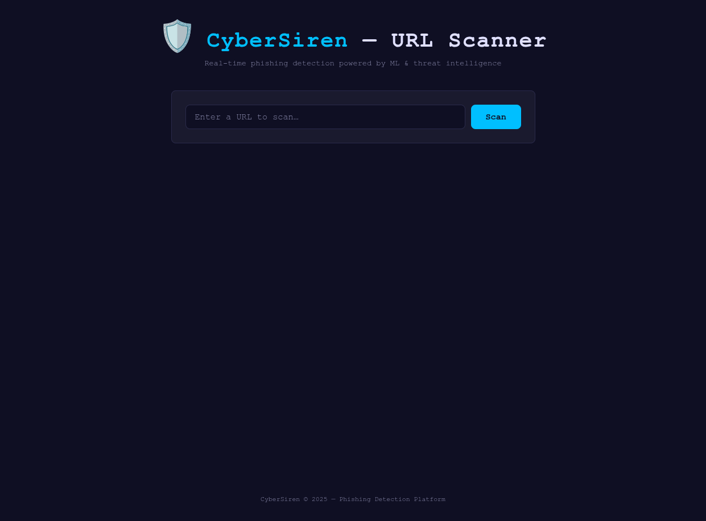
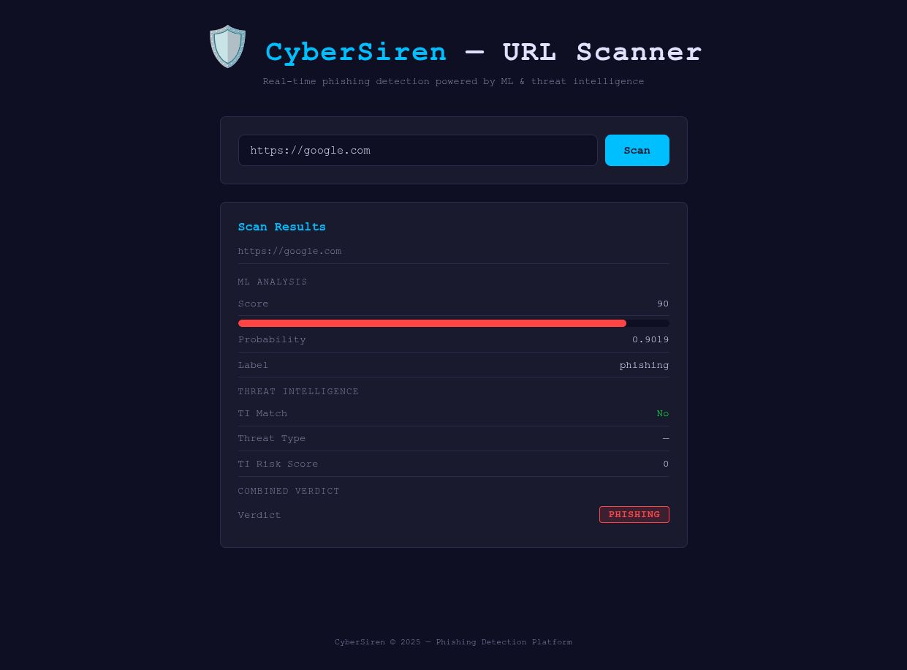
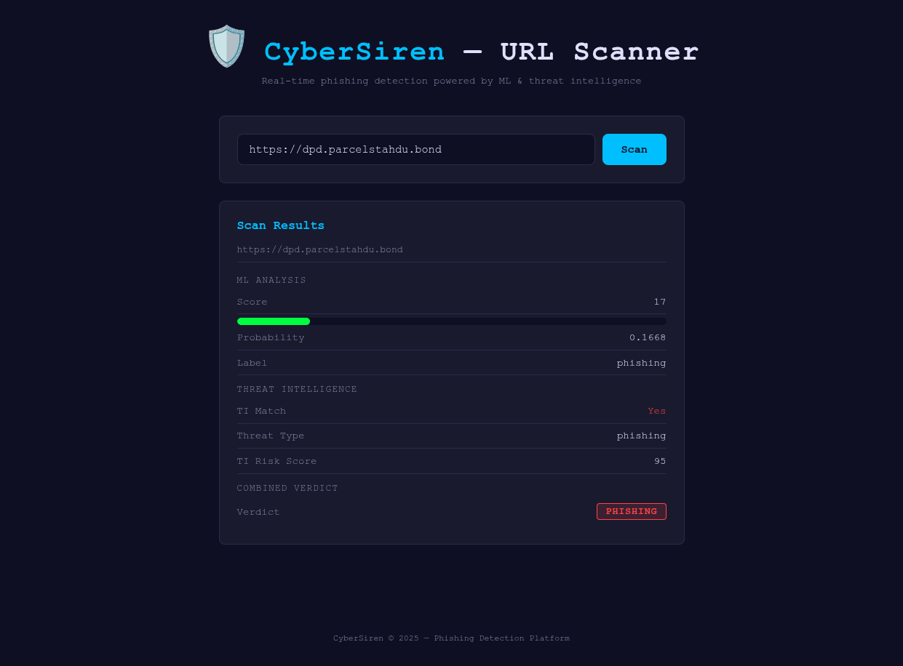
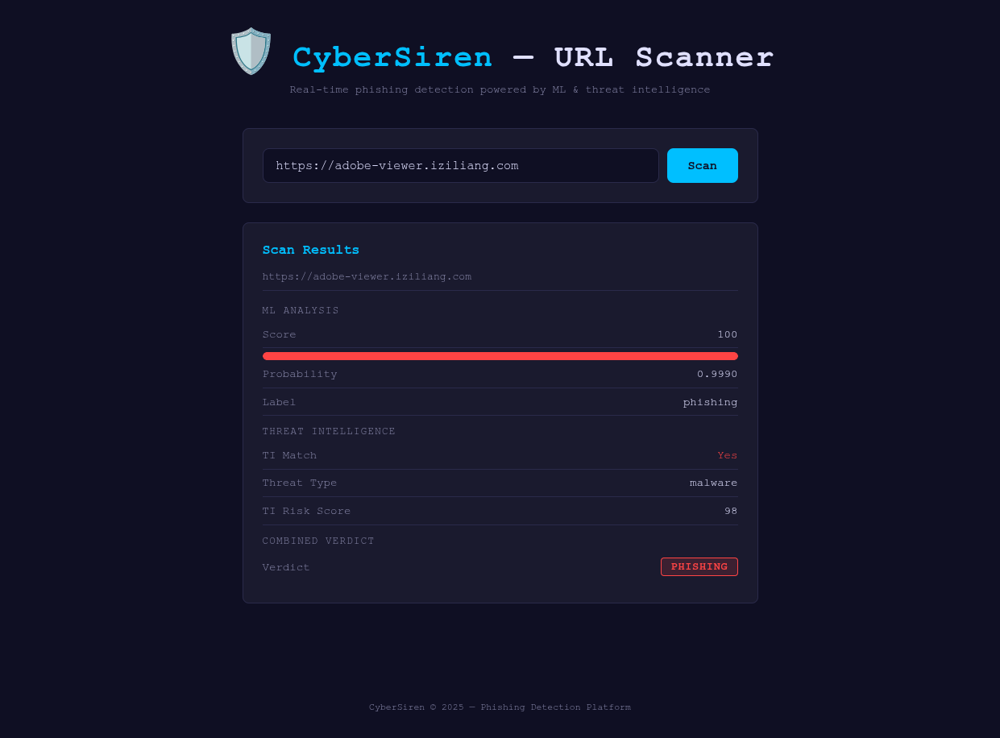
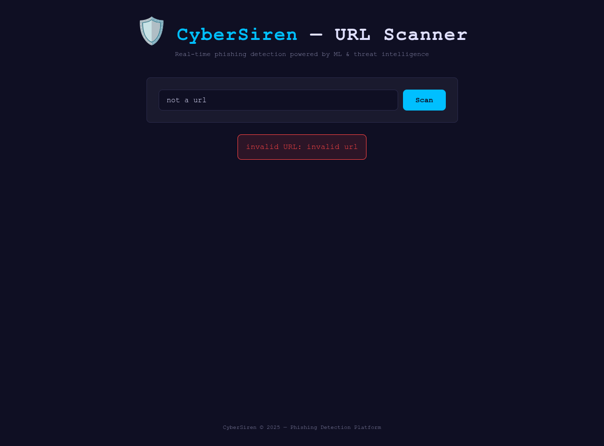

# CyberSiren URL Scanner — Demo Guide

## Overview

This demo runs **svc-03-url-analysis**, the CyberSiren URL analysis service.
Paste any URL and get an instant phishing risk assessment powered by:

| Engine | How it works |
|--------|-------------|
| **ML model** | A LightGBM classifier scores the URL (0–100) based on 28 lexical/structural features extracted from the URL itself — no network requests needed. |
| **Threat Intelligence** | The URL's domain is checked against a Valkey (Redis-compatible) cache populated from the `ti_indicators` Postgres table. Matches return the threat type and risk score. |

Both checks run **in parallel**; results are merged into a single verdict
(`legitimate` / `suspicious` / `phishing`) and displayed in a web UI or returned
via the JSON API.

---

## Prerequisites

| Requirement | Notes |
|-------------|-------|
| **Docker** + **Docker Compose v2** | `docker compose version` should print v2.x |
| **~2 GB disk** | Python ML dependencies (NumPy, LightGBM, joblib) + model file |
| **Free ports** | `5432` (Postgres), `6379` (Valkey), `8083` (svc-03 HTTP), `9091` (Prometheus metrics) |

---

## Quick Start

```bash
# 1. Clone the repo and cd into it
git clone https://github.com/XHCFS/cybersiren.git
cd cybersiren

# 2. Start the demo stack (Postgres + Valkey + demo-seed + svc-03)
docker compose -f deploy/compose/docker-compose.yml --profile demo up --build
```

That's it — no environment variables needed. The compose file supplies all
defaults automatically.

---

## What Happens on Startup

The demo profile launches **four containers**:

| Container | Purpose |
|-----------|---------|
| **postgres** | PostgreSQL 15 database — stores TI indicators and schema |
| **valkey** | Redis-compatible in-memory cache for TI domain lookups |
| **demo-seed** | One-shot init container — runs migrations and seeds 20 real threat-indicator domains |
| **svc-03-url-analysis** | The URL scanner service (Go + Python ML) |

### Startup sequence

1. **postgres** and **valkey** start and pass their health-checks.
2. **demo-seed** runs all SQL migrations, seeds four TI feed definitions, and
   inserts 20 real-world threat-indicator domains sourced from OpenPhish and
   URLhaus. Look for `Demo seed complete.` in the logs.
3. **svc-03-url-analysis** builds (Go binary + Python ML environment), connects
   to Postgres and Valkey, refreshes the TI domain cache, spawns 2 Python
   inference workers, and starts listening. Look for:
   ```
   svc-03-url-analysis started  port=8083  metrics_port=9090
   ```
4. Open **<http://localhost:8083>** in your browser.

The first build takes 2–4 minutes (downloading Go/Python deps). Subsequent
starts reuse the Docker layer cache and are much faster.

---

## Using the Web UI

Open **<http://localhost:8083>** in your browser. You'll see the scanner landing
page:



1. **Enter a URL** in the input field (e.g. `https://google.com` or
   `https://dpd.parcelstahdu.bond`).
2. Click **Scan** (or press Enter).
3. Results appear in three sections:

### ML Analysis

| Field | Meaning |
|-------|---------|
| **Score** | 0–100 phishing risk score (0 = safe, 100 = certain phishing). Shown with a color bar. |
| **Probability** | Raw model probability (0.0–1.0). |
| **Label** | `legitimate` (score < 40), `suspicious` (40–69), or `phishing` (≥ 70). |

### Threat Intelligence

| Field | Meaning |
|-------|---------|
| **TI Match** | `Yes` (red) if the domain was found in the TI cache, `No` (green) otherwise. |
| **Threat Type** | Category from the TI feed — `phishing`, `malware`, or `botnet_cc`. |
| **TI Risk Score** | 0–100 risk score assigned by the feed. |

### Combined Verdict

The final badge merges both signals:

| Color | Verdict | Rule |
|-------|---------|------|
| 🟢 Green | **LEGITIMATE** | ML score < 40 and no high-risk TI match |
| 🟡 Yellow | **SUSPICIOUS** | ML score 40–69 |
| 🔴 Red | **PHISHING** | ML score ≥ 70 **or** TI match with risk ≥ 80 |

### What does "degraded" mean?

If the ML Python subprocess crashes or times out, the service returns a neutral
score of 50 / 0.5 and sets `"degraded": true`. A yellow warning banner appears
in the UI:

> ⚠️ Some analysis components were unavailable. Results may be incomplete.

TI lookup still runs, so known-bad domains are still flagged even in degraded
mode.

---

## Web UI Testing Walkthrough

Open **<http://localhost:8083>** and try these four tests in order:

### Test 1 — ML-only scan (no TI match)

Paste `https://google.com` and click **Scan**.



- **TI Match** = No (google.com is not in the seed data).
- **ML Score** ≈ 90, **Probability** ≈ 0.90, **Label** = phishing.
- The ML model scores purely on URL lexical features; google.com's short
  structure happens to trigger a high score. This is a known model quirk and is
  fine for the demo — it shows the ML engine working independently.

### Test 2 — Phishing TI match + ML

Paste `https://dpd.parcelstahdu.bond` and click **Scan**.



- **TI Match** = Yes (red) — this domain is seeded as an OpenPhish phishing
  indicator with risk score 95.
- **ML Score** ≈ 17, **Probability** ≈ 0.17.
- The verdict is **PHISHING** because the TI risk (95) is ≥ 80, even though the
  ML score alone is low.

### Test 3 — Malware TI match

Paste `https://adobe-viewer.iziliang.com` and click **Scan**.



- **TI Match** = Yes — seeded as a URLhaus malware indicator with risk score 98.
- **Threat Type** = malware.
- The verdict badge turns red regardless of ML score.

### Test 4 — Error handling

Leave the input field **empty** and click Scan (or type random junk like
`not a url`).



- The UI shows an error message: **"url is required"** or
  **"invalid URL: invalid url"**.
- No crash, no blank screen — the API validates input and returns a clean error.

---

## API Reference

### `POST /scan`

Analyse a single URL.

**Request:**

```json
{
  "url": "https://example.com/path"
}
```

**Response (success):**

```json
{
  "success": true,
  "data": {
    "url": "https://example.com/path",
    "score": 12,
    "probability": 0.1234,
    "label": "legitimate",
    "ti_match": false,
    "ti_threat_type": "",
    "ti_risk_score": 0,
    "degraded": false
  }
}
```

| Field | Type | Description |
|-------|------|-------------|
| `url` | string | The URL that was scanned |
| `score` | int | 0–100 phishing risk score from the ML model |
| `probability` | float | Raw model probability (0.0–1.0) |
| `label` | string | `legitimate`, `suspicious`, or `phishing` |
| `ti_match` | bool | Whether the domain matched a TI indicator |
| `ti_threat_type` | string | `phishing`, `malware`, `botnet_cc`, or `""` |
| `ti_risk_score` | int | 0–100 risk score from the TI feed (0 if no match) |
| `degraded` | bool | `true` if ML was unavailable (score defaults to 50/0.5) |

**Response (error):**

```json
{
  "success": false,
  "error": {
    "status": 400,
    "code": "bad_request",
    "message": "url is required"
  }
}
```

---

## curl Examples

#### 1. Scan a well-known URL (ML-only, no TI match)

```bash
curl -s http://localhost:8083/scan \
  -H 'Content-Type: application/json' \
  -d '{"url": "https://google.com"}' | jq .
```

```json
{
  "success": true,
  "data": {
    "url": "https://google.com",
    "score": 90,
    "probability": 0.9019,
    "label": "phishing",
    "ti_match": false,
    "ti_threat_type": "",
    "ti_risk_score": 0,
    "degraded": false
  }
}
```

> **Note:** The ML model scores purely on lexical URL features. A high score for
> `google.com` is a known model quirk — it demonstrates the ML engine working
> independently of TI.

#### 2. Scan a seeded phishing domain (TI match)

```bash
curl -s http://localhost:8083/scan \
  -H 'Content-Type: application/json' \
  -d '{"url": "https://dpd.parcelstahdu.bond"}' | jq .
```

```json
{
  "success": true,
  "data": {
    "url": "https://dpd.parcelstahdu.bond",
    "score": 17,
    "probability": 0.1668,
    "label": "phishing",
    "ti_match": true,
    "ti_threat_type": "phishing",
    "ti_risk_score": 95,
    "degraded": false
  }
}
```

> The label is `"phishing"` because the TI risk score (95) is ≥ 80, even though
> the ML score alone (17) would rate it as `"legitimate"`.

#### 3. Scan a seeded malware domain

```bash
curl -s http://localhost:8083/scan \
  -H 'Content-Type: application/json' \
  -d '{"url": "https://adobe-viewer.iziliang.com"}' | jq .
```

```json
{
  "success": true,
  "data": {
    "url": "https://adobe-viewer.iziliang.com",
    "score": 17,
    "probability": 0.1668,
    "label": "phishing",
    "ti_match": true,
    "ti_threat_type": "malware",
    "ti_risk_score": 98,
    "degraded": false
  }
}
```

> The `label` is `"phishing"` even for malware TI matches because the
> TI risk score (98) is ≥ 80 — see the verdict rules above.

#### 4. Scan a seeded botnet C2 domain

```bash
curl -s http://localhost:8083/scan \
  -H 'Content-Type: application/json' \
  -d '{"url": "https://agentscript.dawnspire.in.net"}' | jq .
```

```json
{
  "success": true,
  "data": {
    "url": "https://agentscript.dawnspire.in.net",
    "score": 17,
    "probability": 0.1668,
    "label": "phishing",
    "ti_match": true,
    "ti_threat_type": "botnet_cc",
    "ti_risk_score": 95,
    "degraded": false
  }
}
```

#### 5. Invalid URL (error case)

```bash
curl -s http://localhost:8083/scan \
  -H 'Content-Type: application/json' \
  -d '{"url": "not a url"}' | jq .
```

```json
{
  "success": false,
  "error": {
    "status": 400,
    "code": "bad_request",
    "message": "invalid URL: invalid url"
  }
}
```

#### 6. Missing URL (error case)

```bash
curl -s http://localhost:8083/scan \
  -H 'Content-Type: application/json' \
  -d '{"url": ""}' | jq .
```

```json
{
  "success": false,
  "error": {
    "status": 400,
    "code": "bad_request",
    "message": "url is required"
  }
}
```

---

## All Seeded Domains

The demo seed (`db/seeds/ti_demo_seed.sql`) loads 20 real-world threat
indicators sourced from OpenPhish and URLhaus. Use any of these for testing:

### Phishing (OpenPhish)

| Domain | Risk Score |
|--------|------------|
| `dpd.parcelstahdu.bond` | 95 |
| `dpd.parcelroutenotice.cfd` | 93 |
| `dpd.parcelsignalpoint.cfd` | 90 |
| `coinbase.aw-windblocker.com` | 92 |
| `coinbase.hrbwya.com` | 88 |
| `airbnb-dev.vercel.app` | 85 |
| `bitfghurt-login.webflow.io` | 87 |
| `cashenta.com` | 100 |

### Malware (URLhaus)

| Domain | Risk Score |
|--------|------------|
| `adobe-viewer.0lsons.com` | 95 |
| `adobe-viewer.iziliang.com` | 98 |
| `adobe-viewer.parallelsw.com` | 92 |
| `ads-storage.biz` | 90 |
| `aetherixcore.cc` | 94 |
| `aaa4b.com` | 100 |
| `adderall.rocks` | 91 |

### Botnet C2 (URLhaus)

| Domain | Risk Score |
|--------|------------|
| `agent-client-stoarge.webredirect.org` | 90 |
| `a08ulcab.highjoke.in.net` | 85 |
| `a4-scan-point.puroflusso.in.net` | 80 |
| `admin-panel.sectoralcontrol.in.net` | 88 |
| `agentscript.dawnspire.in.net` | 95 |

---

## Observability

### Structured Logs

The demo runs with `CYBERSIREN_LOG__PRETTY=true`, so svc-03 emits
human-readable, color-coded logs via zerolog's `ConsoleWriter`. Every line
carries a `service=cybersiren` field automatically.

#### Viewing logs in real-time

```bash
# Follow svc-03 logs only
docker compose -f deploy/compose/docker-compose.yml --profile demo \
  logs -f svc-03-url-analysis

# Follow ALL demo containers (postgres, valkey, demo-seed, svc-03)
docker compose -f deploy/compose/docker-compose.yml --profile demo logs -f
```

#### Structured debug log (scan complete)

Each scan emits a DEBUG-level line with all result fields:

```
02:54:47 DBG scan complete degraded=false label=phishing ml_prob=0.9018710388347376 ml_score=90 service=cybersiren ti_match=false ti_risk=0 ti_threat= url=https://google.com
02:54:47 DBG scan complete degraded=false label=phishing ml_prob=0.16677812442809192 ml_score=17 service=cybersiren ti_match=true ti_risk=95 ti_threat=phishing url=https://dpd.parcelstahdu.bond
```

This is useful for verifying that both engines are running and producing the
expected results without needing to parse JSON API responses.

#### Startup logs

A healthy boot prints the following sequence (timestamps will differ):

```
# ── Python model workers loading (printed to stderr by inference_script.py) ──
INFO: model loaded from /app/ml/inference_script.py
READY
INFO: model loaded from /app/ml/inference_script.py
READY

# ── zerolog structured output (pretty mode) ──────────────────────────────────
10:32:01 INF connected to postgres db_host=postgres service=cybersiren
10:32:01 INF connected to valkey valkey_addr=valkey:6379 service=cybersiren
10:32:01 INF svc-03-url-analysis started metrics_port=9090 port=8083 service=cybersiren
```

| Log line | What it means |
|----------|---------------|
| `connected to postgres` | pgx pool opened and ping succeeded |
| `connected to valkey` | Valkey client connected |
| `svc-03-url-analysis started` | HTTP server listening; the service is ready for requests |

If the TI cache refresh fails (e.g. empty `ti_indicators` table), you'll also
see:

```
10:32:01 ERR initial TI domain cache refresh failed error="..." service=cybersiren
```

This is non-fatal — the service still starts, but all TI lookups return
`ti_match: false` until the cache is populated.

#### Request logs

Each scan produces two kinds of log output:

**1. Gin access log** — printed by Gin's built-in `Logger()` middleware:

```
[GIN] 2025/06/15 - 10:33:45 | 200 |   48.291ms |    172.17.0.1 | POST     "/scan"
```

This shows the HTTP status, latency, client IP, and route. A `400` here means
the request body was rejected (missing/invalid URL).

**2. zerolog application logs** — emitted by the scan handler, TI checker, or
ML model when something noteworthy happens:

```
# Feature extraction failed (ML falls back to neutral 50/0.5)
10:33:45 WRN feature extraction failed error="..." url=https://example.com service=cybersiren

# Domain couldn't be parsed for TI lookup
10:33:45 WRN failed to extract domain for TI check error="..." url=not-a-url service=cybersiren

# Valkey lookup error (TI check still returns no-match gracefully)
10:33:45 WRN TI cache lookup failed domain=example.com error="..." service=cybersiren

# Python subprocess crashed (worker is auto-respawned)
10:33:45 ERR url model: write to worker stdin error="broken pipe" component=url_model service=cybersiren

# Inference timed out (5s deadline exceeded)
10:33:45 ERR url model: inference timeout error="context deadline exceeded" component=url_model service=cybersiren
```

> **Note:** Successful scans at the default `debug` level also produce the
> structured `DBG scan complete` line shown above. At `info` level and above,
> successful scans produce only the Gin access log line.

#### Shutdown logs

When you press `Ctrl-C` or run `docker compose down`, svc-03 logs a clean
shutdown sequence:

```
10:45:00 INF shutting down... service=cybersiren
10:45:00 INF shutdown complete service=cybersiren
```

If shutdown takes longer than 10 seconds (e.g. in-flight requests still
draining), you may see timeout errors before the final message.

#### Filtering logs

Pipe through `grep` to isolate specific events:

```bash
# Only TI-related messages (matches & lookup errors)
docker compose -f deploy/compose/docker-compose.yml --profile demo \
  logs -f svc-03-url-analysis 2>&1 | grep -E "TI|ti_"

# Only errors and warnings
docker compose -f deploy/compose/docker-compose.yml --profile demo \
  logs -f svc-03-url-analysis 2>&1 | grep -E "ERR|WRN"

# Only Gin access logs for /scan requests
docker compose -f deploy/compose/docker-compose.yml --profile demo \
  logs -f svc-03-url-analysis 2>&1 | grep 'POST.*"/scan"'

# ML model issues only
docker compose -f deploy/compose/docker-compose.yml --profile demo \
  logs -f svc-03-url-analysis 2>&1 | grep "url_model\|url model"

# Startup sequence (connection messages)
docker compose -f deploy/compose/docker-compose.yml --profile demo \
  logs svc-03-url-analysis 2>&1 | grep -E "connected to|started"
```

#### Log levels

Control verbosity by changing `CYBERSIREN_LOG__LEVEL` in the svc-03 environment
block of `docker-compose.yml` (or pass it as an override):

| Level | What it shows | Use when… |
|-------|---------------|-----------|
| `debug` | Everything — including `scan complete` lines with all fields | Investigating a specific bug |
| `info` | Startup, connections, operational events | **Day-to-day demo use (default)** |
| `warn` | Graceful degradation events (feature extraction failures, TI lookup errors) | Monitoring for partial failures |
| `error` | ML subprocess crashes, cache command failures, shutdown errors | Alerting on things that need fixing |

To change the level without editing the compose file:

```bash
CYBERSIREN_LOG__LEVEL=warn \
  docker compose -f deploy/compose/docker-compose.yml --profile demo up
```

> **Tip:** Gin's access logger is independent of zerolog and always prints
> regardless of the `CYBERSIREN_LOG__LEVEL` setting. To silence Gin, set
> `GIN_MODE=release` in the environment.

### Prometheus Metrics

svc-03 exposes Prometheus metrics on port **9091** on the host (mapped to the
container's internal port 9090).

#### Accessing metrics

Open **<http://localhost:9091/metrics>** in your browser, or use curl:

```bash
curl -s http://localhost:9091/metrics
```

#### Key metrics

| Metric | Type | Description |
|--------|------|-------------|
| `ti_cache_blocklist_lookups_total{hit="true"}` | counter | TI cache hits (domain found in Valkey) |
| `ti_cache_blocklist_lookups_total{hit="false"}` | counter | TI cache misses (domain not found) |
| `ti_cache_refresh_keys_total` | gauge | Number of domains loaded into the Valkey TI cache |
| `ti_cache_refresh_duration_seconds` | histogram | Time taken to refresh the TI domain cache |
| `feed_sync_db_upsert_duration_seconds` | histogram | DB upsert latency (registered by shared code) |

#### Querying specific metrics

```bash
# Check TI cache hit/miss counts
curl -s http://localhost:9091/metrics | grep ti_cache_blocklist_lookups_total

# See how many domains were loaded into the cache
curl -s http://localhost:9091/metrics | grep ti_cache_refresh_keys_total

# Check cache refresh timing
curl -s http://localhost:9091/metrics | grep ti_cache_refresh_duration_seconds
```

After scanning a few seeded domains, you should see `hit="true"` counters
increment. Scanning domains not in the seed data increments `hit="false"`.

---

## Testing with Real Threat Intelligence

The demo seed provides 20 real domains from public feeds. To test against an
even wider set of **live** phishing/malware indicators, you can also run
**svc-11-ti-sync** which fetches data from four public feeds:

| Feed | Source | Auth |
|------|--------|------|
| [PhishTank](https://phishtank.org/) | Community-verified phishing URLs | API key required |
| [OpenPhish](https://openphish.com/) | Curated phishing feed | None |
| [URLhaus](https://urlhaus.abuse.ch/) | abuse.ch malware URL feed | None |
| [ThreatFox](https://threatfox.abuse.ch/) | abuse.ch IOC feed | None |

### Steps

```bash
# 1. Make sure Postgres + Valkey are running (the demo profile already starts them)
docker compose -f deploy/compose/docker-compose.yml --profile demo up -d

# 2. Run svc-11-ti-sync natively (requires Go 1.25+)
#    Copy and adjust the env file first:
cp services/svc-11-ti-sync/configs/.env.example services/svc-11-ti-sync/configs/.env
#    Edit .env — at minimum set CYBERSIREN_DB__HOST, CYBERSIREN_DB__PORT, etc.
#    The DB defaults (user=postgres, password=postgres) match the demo compose.
#    For PhishTank, also set CYBERSIREN_FEEDS__PHISHTANK_API_KEY

go run ./services/svc-11-ti-sync/cmd/ti-sync/
```

svc-11 will:

1. Fetch each enabled feed.
2. Parse and upsert indicators into `ti_indicators` in Postgres.
3. Log a summary of new/updated rows per feed.

svc-03 refreshes its Valkey domain cache **at startup** from Postgres, so
**restart svc-03** after svc-11 finishes to pick up the new indicators:

```bash
docker compose -f deploy/compose/docker-compose.yml restart svc-03-url-analysis
```

Now scanning URLs from real phishing campaigns will produce TI matches.

---

## Architecture

```
┌──────────┐
│ Browser  │
└────┬─────┘
     │  POST /scan  { "url": "..." }
     ▼
┌──────────────────────────────────────┐
│         svc-03-url-analysis          │
│           (Go + Gin HTTP)            │
│                                      │
│  ┌─────────────┐  ┌──────────────┐  │
│  │ ML Scoring   │  │ TI Checker   │  │  ◄── parallel goroutines
│  │              │  │              │  │
│  │  Extract 28  │  │ Domain from  │  │
│  │  URL features│  │ normalized   │  │
│  │  → Python    │  │ URL → Valkey │  │
│  │  subprocess  │  │ HGET lookup  │  │
│  └──────┬───────┘  └──────┬───────┘  │
│         │                 │          │
│         ▼                 ▼          │
│    score + prob      matched?        │
│    (0-100)           threat_type     │
│                      risk_score      │
│                                      │
│   ─── merge into verdict ────────►   │
│   label: legitimate/suspicious/      │
│          phishing                    │
└──────────────────────────────────────┘
     │                          │
     ▼                          ▼
┌──────────┐            ┌────────────┐
│  Python  │            │   Valkey   │
│ LightGBM │            │  TI cache  │
│ (subproc)│            │ (HSET/HGET)│
└──────────┘            └─────┬──────┘
                              │ populated at svc-03 startup
                              ▼
                        ┌────────────┐
                        │ PostgreSQL │
                        │ti_indicators│
                        └─────┬──────┘
                              │ seeded by
                    ┌─────────┴──────────┐
                    │                    │
              ┌─────┴─────┐    ┌─────────┴──────┐
              │ demo-seed  │    │ svc-11-ti-sync │
              │ (20 real   │    │ (real feeds:   │
              │  domains)  │    │  PhishTank,    │
              └────────────┘    │  URLhaus, etc.)│
                                └────────────────┘
```

### Data flow summary

1. **Browser** sends `POST /scan` with a URL.
2. **svc-03** normalizes the URL and launches two goroutines in parallel:
   - **ML scoring** — extracts 28 lexical features from the URL string and sends
     them to a pre-spawned Python subprocess running a LightGBM model. Returns a
     0–100 score and probability.
   - **TI lookup** — extracts the domain, queries the Valkey hash
     (`ti:domains`). If the domain exists, returns the threat type and risk
     score.
3. Results are merged: a TI match with risk ≥ 80 **or** an ML score ≥ 70
   overrides the label to `"phishing"`.
4. JSON response is returned in the standard CyberSiren envelope.

---

## Configuration

All config is via environment variables prefixed with `CYBERSIREN_`. Double
underscores map to struct nesting (e.g. `CYBERSIREN_DB__HOST` → `config.DB.Host`).

See the full reference in
[`services/svc-03-url-analysis/configs/.env.example`](services/svc-03-url-analysis/configs/.env.example).

### Key variables

| Variable | Default (in demo compose) | Description |
|----------|--------------------------|-------------|
| `CYBERSIREN_SERVER__PORT` | `8083` | HTTP port for the scan API and web UI |
| `CYBERSIREN_DB__HOST` | `postgres` | Postgres host (container name in compose) |
| `CYBERSIREN_DB__PORT` | `5432` | Postgres port |
| `CYBERSIREN_DB__NAME` | `cybersiren` | Database name |
| `CYBERSIREN_DB__USER` | `postgres` | Database user |
| `CYBERSIREN_DB__PASSWORD` | `postgres` | Database password |
| `CYBERSIREN_DB__SSL_MODE` | `disable` | Postgres SSL mode |
| `CYBERSIREN_VALKEY__ADDR` | `valkey:6379` | Valkey address (container name in compose) |
| `CYBERSIREN_ML__URL_MODEL_PATH` | `./ml/inference_script.py` | Path to the Python inference script |
| `CYBERSIREN_METRICS_PORT` | `9090` | Prometheus metrics port (inside container) |
| `CYBERSIREN_AUTH__JWT_SECRET` | `demo-secret-not-for-production-use!!` | JWT signing secret (demo only) |
| `CYBERSIREN_JAEGER_ENDPOINT` | *(empty)* | OTLP endpoint; leave empty to disable tracing |
| `CYBERSIREN_LOG__LEVEL` | `debug` | Log level (`debug`, `info`, `warn`, `error`) |
| `CYBERSIREN_LOG__PRETTY` | `true` | Human-readable log output |

> **Note:** The compose file uses `${POSTGRES_USER:-postgres}` /
> `${POSTGRES_PASSWORD:-postgres}` defaults, which match the postgres
> container's built-in defaults. You do **not** need to set `POSTGRES_USER` or
> `POSTGRES_PASSWORD`.

---

## Other Endpoints

| Endpoint | Port | Method | Description |
|----------|------|--------|-------------|
| `/` | 8083 | GET | Serves the web UI (`static/index.html`) |
| `/healthz` | 8083 | GET | Returns `200 ok` — useful for readiness probes |
| `/metrics` | 9091 (host) | GET | Prometheus metrics (container port 9090 → host 9091) |

---

## Troubleshooting

### Port conflicts

```
Error starting userland proxy: listen tcp4 0.0.0.0:5432: bind: address already in use
```

Another process is using the port. Either stop it or change the host port
mapping in the compose file. For svc-03 itself, change `CYBERSIREN_SERVER__PORT`
in the compose file.

### Docker build failures (Python deps)

If `pip3 install lightgbm` fails, it's usually a platform/arch issue. Make sure
you're on `linux/amd64` or `linux/arm64`. If building on Apple Silicon, Docker
Desktop's Rosetta emulation handles it.

### Missing libgomp / scikit-learn import errors

If you see `ImportError: libgomp.so.1: cannot open shared object file` or
scikit-learn import failures, the Docker image cache is stale. Rebuild from
scratch:

```bash
docker compose -f deploy/compose/docker-compose.yml --profile demo build --no-cache svc-03-url-analysis
docker compose -f deploy/compose/docker-compose.yml --profile demo up
```

### "connection refused" errors

```
failed to load config  error="dial tcp 127.0.0.1:5432: connect: connection refused"
```

The service started before Postgres or Valkey were ready. The `depends_on` +
`condition: service_healthy` in docker-compose handles this automatically. If
you see it, just wait a few seconds and restart:

```bash
docker compose -f deploy/compose/docker-compose.yml restart svc-03-url-analysis
```

### "could not write init file" (Postgres)

If Postgres fails to start with an init file error, the container's data volume
may be corrupted. Restart the postgres container:

```bash
docker compose -f deploy/compose/docker-compose.yml restart postgres
```

If that doesn't work, reset the volume:

```bash
docker compose -f deploy/compose/docker-compose.yml --profile demo down -v
docker compose -f deploy/compose/docker-compose.yml --profile demo up --build
```

### Empty TI results (every domain returns `ti_match: false`)

The Valkey TI cache is populated at svc-03 startup. If the demo-seed hasn't
finished or svc-03 started before the seed completed, the cache is empty.

**Fix:** check the logs for `Demo seed complete.`, then restart svc-03:

```bash
docker compose -f deploy/compose/docker-compose.yml restart svc-03-url-analysis
```

### ML model always returns score 50 / probability 0.5

This means the Python subprocess failed or timed out. Check the logs for:

```
url model: spawn worker 0: worker readiness: ...
```

Common causes:

- **Missing model file** — `model.joblib` must exist at
  `services/svc-03-url-analysis/ml/model.joblib` before building the Docker
  image.
- **Python dependency mismatch** — the model was trained with a different
  `lightgbm` or `scikit-learn` version. Rebuild with `--no-cache`:
  ```bash
  docker compose -f deploy/compose/docker-compose.yml --profile demo build --no-cache svc-03-url-analysis
  ```

### "No space left on device"

Docker images and build cache can consume significant disk space. Prune unused
resources:

```bash
docker system prune -f --volumes
```

Then rebuild:

```bash
docker compose -f deploy/compose/docker-compose.yml --profile demo up --build
```

### Postgres authentication failure

```
FATAL: password authentication failed for user "postgres"
```

The Postgres container was likely created with different credentials in a
previous run. Reset the volume to start fresh:

```bash
docker compose -f deploy/compose/docker-compose.yml --profile demo down -v
docker compose -f deploy/compose/docker-compose.yml --profile demo up --build
```

---

## Stopping the Demo

```bash
# Stop containers (preserves database volume for next run)
docker compose -f deploy/compose/docker-compose.yml --profile demo down

# Stop and remove all data (fresh start next time)
docker compose -f deploy/compose/docker-compose.yml --profile demo down -v
```
